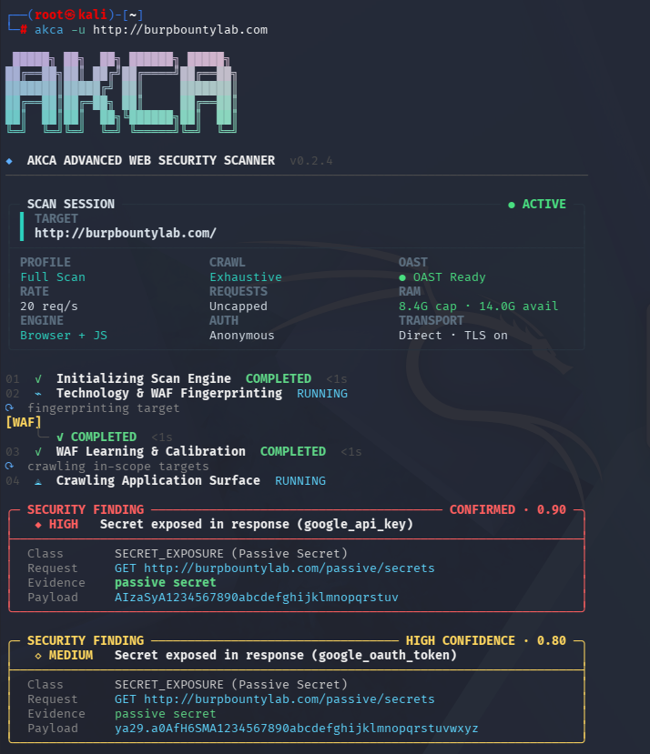

<p align="center">
  
</p>

<h1 align="center">AKCA</h1>
<p align="center"><strong>Advanced Web Security Scanner</strong></p>
<p align="center">Discover endpoints. Test web applications. Inspect the evidence.</p>

<p align="center">
  <a href="https://github.com/akha-security/akca/actions/workflows/ci.yml"></a>
  <a href="https://github.com/akha-security/akca/releases/tag/v0.2.4"></a>
  <a href="https://go.dev/"></a>
  <a href="LICENSE"></a>
</p>

<p align="center">
  <a href="#installation">Installation</a> ·
  <a href="#usage">Usage</a> ·
  <a href="#how-akca-works">Workflow</a> ·
  <a href="#scan-profiles">Profiles</a> ·
  <a href="#security-testing-coverage">Coverage</a> ·
  <a href="#reports">Reports</a> ·
  <a href="#support-the-mission">Support</a> ·
  <a href="FEATURES.md">Features</a> ·
  <a href="CHANGELOG.md">Changelog</a>
</p>

AKCA is an open-source, evidence-oriented Dynamic Application Security Testing (DAST) scanner written in Go. It combines HTTP and browser-assisted crawling, JavaScript analysis, API imports, adaptive active testing, passive inspection, and replayable evidence in one command-line workflow.

## Why AKCA

Many scanners crawl an application and then send a broad payload set to every discovered endpoint. That strategy can create unnecessary traffic, trigger defensive systems, and produce weak signals that require substantial manual triage. AKCA takes a more contextual approach: it first learns about the target, models the discovered attack surface, and then selects tests according to the technology stack, parameters, authentication state, WAF behavior, and available verification capabilities.

AKCA is designed to:

- Discover hidden routes, JavaScript-loaded endpoints, undocumented parameters, API operations, and access-controlled paths before active testing.
- Fingerprint technology and WAF behavior, then calibrate request pacing and safe payload transformations to the observed target.
- Allocate work across endpoint, method, parameter, and module combinations instead of blindly applying every payload everywhere.
- Pause and recover from rate limiting or host-level blocking, within configured scan and time limits.
- Replay promising signals with baselines, negative controls, state checks, identity comparisons, or OAST callbacks before promoting them to findings.
- Preserve request, response, payload, confidence, and proof-policy context so results can be investigated rather than accepted on faith.

The goal is not to exhaust or overwhelm the target. It is to find real weaknesses with deliberate requests and useful evidence.

AKCA does not claim feature or detection parity with mature commercial platforms such as Acunetix, Invicti/Netsparker, or Burp Suite Professional. Those products are built by experienced teams over many years. AKCA is independently maintained by one developer in available personal time, inspired by established security tools and shaped by original ideas and community feedback. The current priority is a simple, useful, and transparent scanner. A graphical interface is planned when the engine is sufficiently stable and dependable.

<p align="center">
  
  <br>
  <sub>AKCA v0.2.4 scan session with live engine status, resource telemetry, and confirmed findings.</sub>
</p>

## Installation

### Go install

Requires **Go 1.25 or newer**.

```bash
go install github.com/akha-security/akca/engine/cmd/akca@latest
akca --version
```

<details>
<summary>Command not found? Configure your PATH.</summary>

For the default Go installation, add the Go binary directory to your current terminal's `PATH`.

**Linux / macOS**

```bash
export PATH="$(go env GOPATH)/bin:$PATH"
```

Add that line to your shell configuration to keep it across sessions.

**Windows PowerShell**

```powershell
$env:Path += ";$(go env GOPATH)\bin"
```

For future sessions, add the same directory to your user `Path` environment variable. If you configured `GOBIN`, use that directory instead.

</details>

### Prebuilt binaries

Download your build from [GitHub Releases](https://github.com/akha-security/akca/releases/latest). Releases include `SHA256SUMS.txt` for checksum verification.

| Platform | Architecture | Asset |
| --- | --- | --- |
| Linux | x64 / ARM64 | `akca-linux-amd64` / `akca-linux-arm64` |
| macOS | Intel / Apple Silicon | `akca-darwin-amd64` / `akca-darwin-arm64` |
| Windows | x64 | `akca-windows-amd64.exe` |

On Linux or macOS, make the downloaded file executable. For Linux x64:

```bash
chmod +x akca-linux-amd64
./akca-linux-amd64 --help
```

On Windows, rename the download to `akca.exe` and run `.\akca.exe --help` in PowerShell. The examples below assume `akca` is available on your `PATH`.

Browser-backed checks require Chrome, Chromium, or Edge.

## Usage

Use AKCA only on systems you own or have permission to test. Replace the example URL with your authorized target.

### Start a scan

```bash
akca -u https://example.com
```

The default profile is `full`. To save an HTML report:

```bash
akca -u https://example.com -f html -o report.html
```

### Choose specific checks

Run SQL injection, XSS, and server-side injection checks, including SSTI:

```bash
akca -u https://example.com -m sql,xss,rce
```

Run passive checks:

```bash
akca -u https://example.com -m passive
```

Passive scans still send requests for discovery and inspection.

### Use an authenticated session

Supply a session cookie:

```bash
akca -u https://example.com -c "session=YOUR_SESSION_COOKIE"
```

Or an authorization header:

```bash
akca -u https://example.com -H "Authorization: Bearer YOUR_TOKEN"
```

Some authorization checks require additional identities or state configuration beyond a single session.

### Import an API definition

```bash
akca -u https://api.example.com --api-spec ./openapi.yaml -m api
```

Discovery supports OpenAPI/Swagger, RAML, Postman, HAR, GraphQL, WSDL, protobuf, and AsyncAPI inputs, including supported ZIP bundles. Testing coverage depends on the imported protocol and operation.

### Inspect traffic through a proxy

```bash
akca -u https://example.com -p http://127.0.0.1:8080
```

Run `akca --help` for all available options.

Use `akca -h` for concise everyday help, or `akca --help` for the complete option reference. Scan targets must be supplied explicitly with `-u` or `--url`.

## Scan profiles

Select a profile with `-m`, or combine several with commas.

| Profile | Checks |
| --- | --- |
| `full` | All enabled active and passive modules; the default |
| `sql` | SQL and NoSQL injection |
| `xss` | Reflected, stored, DOM, and blind XSS; related client-side checks |
| `rce` | Command injection, SSTI, deserialization, and related checks |
| `api` | API exposure, BOLA/IDOR, BFLA, mass assignment, and token checks |
| `graphql` | GraphQL schema and operation checks |
| `ssrf` | SSRF, XXE, and related out-of-band checks |
| `auth` | Authentication, authorization, CSRF, and cookie/header checks |
| `passive` | Metadata, TLS, security headers, secrets, and component analysis |
| `fuzz` | Paths, exposed artifacts, traversal, and related checks |

Execution depends on discovered endpoints, configuration, available verification capabilities, and scan limits. See [FEATURES.md](FEATURES.md) for the full capability guide.

## How AKCA works

AKCA uses a staged pipeline so later checks can benefit from facts learned earlier:

1. **Fingerprint and calibrate** — identify technologies, server behavior, WAF signals, TLS posture, and safe request pacing.
2. **Discover the attack surface** — combine HTTP crawling, a persistent browser session, JavaScript analysis, API definitions, path fuzzing, parameter discovery, and 403 bypass observations.
3. **Model test candidates** — group endpoints by method, content type, parameters, authentication context, and likely vulnerability class.
4. **Plan adaptive probes** — prioritize relevant payload families, preserve work for later endpoints, and apply target-aware encoding or pacing when defensive behavior is observed.
5. **Verify signals** — compare baselines and controls, replay promising results, inspect state or identity changes, and correlate OAST callbacks where required.
6. **Produce evidence** — export findings with Burp-style HTTP transactions, payloads, classifications, confidence, proof status, and reproduction guidance.

Coverage is explicit. A skipped, failed, budget-limited, or unfinished target is recorded as incomplete coverage; it is not silently treated as a clean security result.

## Security testing coverage

The following list describes implemented discovery engines and security-test families. Individual checks run only when the discovered surface, scan profile, configuration, safety policy, and verification prerequisites make them applicable. A listed capability is not a guarantee that every variant of a vulnerability will be detected.

<details>
<summary><strong>1. Discovery, crawling, and analysis engines</strong></summary>

- Technology and WAF fingerprinting
- WAF learning, request calibration, and adaptive traffic recovery
- HTTP and headless-browser application crawling for traditional and client-rendered applications
- JavaScript and AST-assisted endpoint analysis, including lazy-loaded application chunks
- Hidden GET, POST, JSON, and form parameter discovery
- Directory, file, backup, and administrative-path fuzzing
- 403 Forbidden bypass testing with header and path transformations
- Reflection-context analysis
- DNS, HTTP, and SMTP OAST callback collection and correlation
- Interactive HTML, JSON, Markdown, CSV, and SARIF report generation

</details>

<details>
<summary><strong>2. Injection and code-execution testing</strong></summary>

- SQL injection: error-based, union, boolean, time-based, and OAST-assisted checks
- Reflected, DOM, stored-candidate, and blind XSS
- Command injection and remote-code-execution signals
- Server-Side Request Forgery (SSRF)
- XML External Entity (XXE) injection
- Local File Inclusion (LFI) and path traversal
- Server-Side and Client-Side Template Injection (SSTI/CSTI)
- NoSQL, LDAP, and XPath injection
- Insecure deserialization
- CRLF injection and HTTP response splitting
- Server-side JavaScript injection
- React Server Components RCE checks
- PDF generation injection and SSRF
- AI/LLM prompt-injection checks
- Second-order and delayed injection workflows

</details>

<details>
<summary><strong>3. Authentication, authorization, and session security</strong></summary>

- Insecure Direct Object References and Broken Object Level Authorization (IDOR/BOLA)
- Broken Function Level Authorization (BFLA)
- Route-authentication bypass
- Broken and improper authentication checks
- JSON Web Token (JWT) security
- OAuth and OpenID Connect flow security
- Cross-Site Request Forgery (CSRF)
- Rate-limit and bypass validation
- Account-recovery weaknesses and account enumeration
- Multi-tenant isolation checks
- Cookie and session security
- Session lifecycle and termination checks

</details>

<details>
<summary><strong>4. Client-side and web-protocol security</strong></summary>

- Cross-Origin Resource Sharing (CORS) misconfiguration
- Open redirects
- JavaScript prototype pollution
- HTTP Parameter Pollution (HPP)
- Host-header injection and poisoning
- HTTP request smuggling (CL.TE and TE.CL)
- Web cache poisoning, cache deception, and Cache-Poisoned Denial of Service (CPDoS)
- WebSocket security and Cross-Site WebSocket Hijacking (CSWSH)
- GraphQL security and introspection exposure
- gRPC and gRPC-Web protocol security
- Reverse-proxy path confusion
- JSONP callback abuse and XSSI exposure

</details>

<details>
<summary><strong>5. Information disclosure and exposed resources</strong></summary>

- Exposed Git repositories and recoverable source artifacts
- Backup and archive files
- Sensitive files and configuration, including environment and application config files
- Source-code disclosure
- Secrets, API keys, tokens, private keys, and sensitive-data exposure
- Swagger and OpenAPI documentation exposure
- Debug and administrative interfaces
- Spring Boot Actuator, Spring Cloud Config, and Jolokia exposure
- DevOps and CI/CD pipeline exposure
- Cloud storage, cloud-native API, and subdomain-takeover checks
- Cloud security posture observations
- WordPress exposure scanning
- Nginx alias traversal
- Next.js middleware bypass
- Framework debug and developer-tool exposure for supported stacks
- IIS shortname confusion
- Firebase Realtime Database and Storage exposure
- Enterprise SaaS exposure checks for supported services

</details>

<details>
<summary><strong>6. Business logic and security posture</strong></summary>

- Race conditions and concurrency flaws
- Business-logic test workflows
- Arbitrary file-upload checks
- Dangerous HTTP methods
- API versioning and hidden API endpoints
- Mass assignment
- Webhook signature and validation security
- Parser differential analysis
- Security headers and TLS/SSL configuration
- Vulnerable third-party components and known-CVE matching
- JavaScript source analysis

</details>

## Scope and scan limits

Set a total request budget and maximum duration:

```bash
akca -u https://example.com --request-budget 5000 --time-budget 30m
```

Or calculate the module budget from discovered URL/method combinations:

```bash
akca -u https://example.com --requests-per-target 200
```

AKCA distributes bounded module budgets across modules, URLs, and parameters. Unused allocations move forward to later work. A positive `--request-budget` takes precedence over `--requests-per-target`.

| Option | Purpose |
| --- | --- |
| `--request-budget 5000` | Cap total requests, including discovery, retries, and redirects |
| `--requests-per-target 200` | Derive the module budget from discovered URL/method combinations |
| `--crawler-budget 1000` | Limit discovery requests |
| `--time-budget 30m` | Limit scan duration |
| `--rate-limit 5` | Limit requests per second |
| `--concurrency 4` | Limit concurrent workers |

By default, the module scan has no request quota. Budget interruptions are reported as **incomplete coverage**. Interrupted targets are not automatically resumed when later work returns unused budget. No budget setting guarantees detection of every vulnerability.

Linked API/service subdomains are outside the default target scope. To include linked subdomains under the same root:

```bash
akca -u https://www.example.com --include-linked-api-subdomains
```

### Why a Full Scan takes longer

AKCA's default Full Scan is designed around coverage and evidence quality, not the shortest possible completion time. Its runtime is therefore not directly comparable to tools that stop after a shallow HTTP crawl or report a vulnerability from a single response difference.

A comprehensive run may take longer because AKCA:

- Maintains a browser session for client-rendered routes and inspects JavaScript, including lazily loaded application chunks.
- Replays promising results with controls before promoting them to findings, reducing false positives caused by generic errors, unstable pages, and WAF responses.
- Performs identity-, state-, and callback-aware checks when a module requires stronger proof.
- Respects target pacing, retries, request budgets, and out-of-band observation windows instead of treating speed as the only success metric.

Scan duration also depends on application size, response latency, authentication flows, defensive controls, and the configured scope. For faster feedback, select only the relevant modules with `-m` or apply explicit crawl, request, and time budgets. Increase rate and concurrency only when the authorized target can safely handle the additional traffic. A shorter scan is not necessarily a more complete scan.

## Reports

Choose an output format with `-f` and a file path with `-o`:

```bash
akca -u https://example.com -f html -o report.html
```

Supported formats: **HTML, JSON, Markdown, CSV, and SARIF**. Each invocation starts a new scan.

HTML reports are self-contained and include the AKCA logo, risk and severity summaries, vulnerability statistics, structured finding details, and expandable HTTP evidence. Request and response tabs support a combined view, full-content expansion, and copying. Where a finding preserves a matching response value, AKCA highlights it in **yellow**, helping you locate a reflected payload or exposed secret. Passive secret findings retain an excerpt around the match.

Depending on the module, findings include:

- Recorded HTTP requests and responses.
- Payloads and cURL reproduction commands.
- Confidence, verification observations, and proof-policy status.
- CWE and OWASP mappings.

Timing findings, missing headers, and external callbacks may have no response text to highlight. Their verification context supplies the relevant evidence.

When the scanner stored a complete raw transaction, the report preserves it exactly. Older or structured-only evidence is rendered in a conventional Burp-style HTTP layout with a request line, ordered headers, a header/body separator, and standard HTTP response reason phrases. If the transport capture limit truncated a response, the report says so explicitly; it never presents the stored portion as the unavailable complete response.

Replay a stored finding:

```bash
akca replay --finding 42
```

Reports mask recognized credentials by default. Raw stored evidence is preserved for replay. Set `redact_reports` to `false` in scan configuration, or use `redact=false` on the report API, only when raw exports are needed. Review reports before sharing: automatic masking cannot recognize every application-specific secret.

### Crawl and proof configuration

The crawler retains one browser session throughout each crawl phase, including cookies and browser storage. It explores explicit non-form tabs and expandable panels; it does not auto-fill or submit forms. Browser requests still obey scope and request budgets. For required third-party static dependencies, configure exact hostnames separately:

```json
{
  "browser_resource_domains": ["cdn.example.com"],
  "redact_reports": true
}
```

This permits only GET/HEAD script, stylesheet, image, font and media requests to those hosts, stripping credential and custom headers. It does not add those hosts to the active scan scope or permit cross-origin API calls. Blocked browser dependencies produce coverage-gap events.

Discovered URLs are retained even when they cannot be visited. A crawl that exhausts its budget with queued work produces a partial scan and a nonzero CLI exit code. Module preflight messages distinguish missing identity/state policies from configured verification capabilities.

Unconfigured rate-limit checks produce observations, not vulnerability findings. A configured threshold proof also requires `window_seconds`; if the requests do not fit inside that window, the check is inconclusive. SQLi does not treat a 400 response or arithmetic evaluation alone as proof. New vendor-specific SQL errors in 400/422 responses must pass the replay and control verification path.

## What's new in v0.2.4

- Preserve complete stored raw HTTP requests and responses in reports, including long bodies, repeated headers, and trailing whitespace.
- Render structured-only traffic in a conventional Burp-style layout with standard request headers, content length, and HTTP reason phrases.
- Add an offline AKCA-branded HTML report, a vulnerability summary table, Request/Response/Both views, full-content controls, and print-safe evidence.
- Rebuild the startup display as a Lipgloss-based Scan Session panel with target emphasis, system and RAM details, and an active-state indicator.
- Replace the scan ETA with a continuously updating elapsed timer and show friendly module names with in-place Running-to-Completed transitions.
- Keep repetitive browser dependency and coverage diagnostics in verbose output while preserving them in scan metadata and reports.

See [CHANGELOG.md](CHANGELOG.md) for release details.

## Support the mission

AKCA does not accept sponsorships or personal donations. Code contributions, testing, documentation, and thoughtful feedback are always welcome.

### Türkiye'den destek olmak isteyenler için

Projeye maddi olarak destek olmak istiyorsanız, bana göndermek yerine **Mehmetçik Vakfı, AFAD, Türk Kızılay veya Çocuk Hizmetleri Genel Müdürlüğü aracılığıyla desteklenen güvenilir sosyal yardım çalışmalarından birine** bağış yapmanızı rica ediyorum. Mümkünse bağışınızı kızım **Akça Aktaş** adına yapın. Bağıştan sonra [X üzerinden @caneraktas_](https://x.com/caneraktas_) hesabına mesaj göndermeniz beni gerçekten çok mutlu eder.

### For supporters outside Türkiye

If you would like to support the project financially, please donate to a reputable charity in your country that helps children, disaster-affected communities, veterans, or people in urgent need. When possible, make the donation in the name of my daughter, **Akça Aktaş**. You are welcome to share it with me on [X at @caneraktas_](https://x.com/caneraktas_); knowing that this project inspired a helpful act would mean a great deal to me.

## Development

Build from source:

```bash
git clone https://github.com/akha-security/akca.git
cd akca/engine
go build -buildvcs=false -trimpath -o ../akca ./cmd/akca
```

On Windows, use `-o ../akca.exe` for the executable name.

Run checks from the `engine` directory:

```bash
go test ./... -count=1
go vet ./...
go run ./cmd/akca benchmark --strict
```

The benchmark measures its observed corpus. For implementation details and verification limitations, read the [architecture guide](engine/docs/ARCHITECTURE.md) and [verification audit](engine/docs/FALSE_POSITIVE_AUDIT.md).

Contributions are welcome. Read [CONTRIBUTING.md](CONTRIBUTING.md) and the [Code of Conduct](CODE_OF_CONDUCT.md) before opening a pull request. Report vulnerabilities in AKCA through [SECURITY.md](SECURITY.md).

## License

[Apache License 2.0](LICENSE) · Copyright 2026 AKHA Security contributors.
